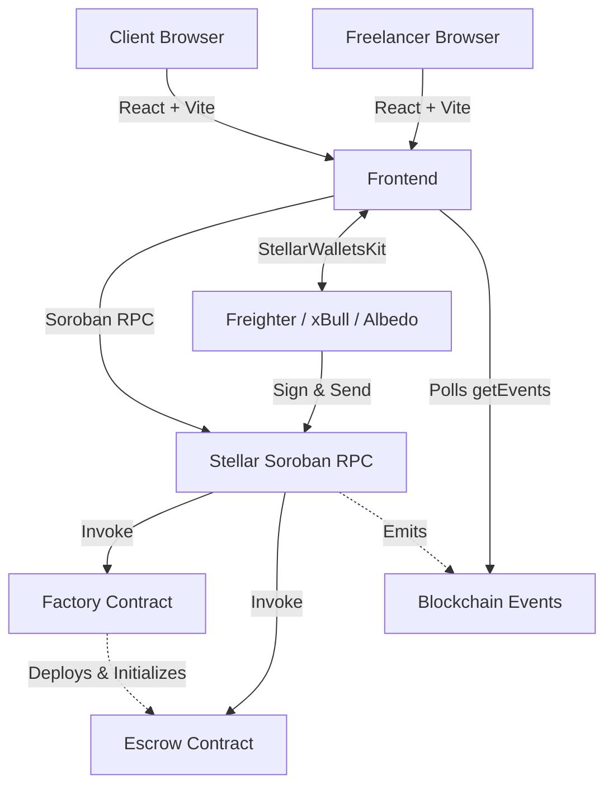

# TrustPay

[](https://github.com/placeholder/repo/actions)
[](https://github.com/placeholder/repo/actions)
[](https://github.com/placeholder/repo/actions)

TrustPay is a secure, decentralized escrow application built on the Stellar network using Soroban smart contracts. It provides a trustless environment for clients and freelancers to securely lock funds, monitor milestones, and release payments upon successful completion of agreed-upon work.

## Features

- **Multi-wallet support (StellarWalletsKit)**: Seamlessly connect with multiple Stellar wallets including Freighter, xBull, and Albedo.
- **Smart contract powered escrow**: Fully decentralized escrow logic handling fund locking, release, and refunds.
- **Escrow lifecycle**: Clear state transitions (Created → Funded → Accepted → Released/Refunded).
- **Transaction tracking**: Real-time status visibility for all contract interactions.
- **Activity feed**: Event synchronization from the blockchain providing a transparent history of actions.
- **Wallet/network validation**: Automatic detection and enforcement of the Stellar Testnet.
- **Modular Smart Contract Architecture**: Factory pattern allows creating individual Escrow contracts, isolating state and risk per transaction.
- **Production-ready UI**: A beautiful, modern interface built with React, Tailwind CSS, and Framer Motion.
- **Automated Deployment**: Deployment scripts and CI/CD pipelines configured via GitHub Actions.
- **Comprehensive Testing**: Robust frontend (`Vitest`, `React Testing Library`) and smart contract (`cargo test`) test suites.
- **Responsive design**: Fully optimized for desktop, tablet, and mobile experiences.

## Tech Stack

### Frontend
- React 19
- TypeScript
- Vite
- Tailwind CSS
- Framer Motion
- React Router DOM
- Lucide React

### Backend / Smart Contract
- Rust
- Soroban SDK

### Blockchain
- Stellar Network (Testnet)
- Soroban RPC

### Wallets
- StellarWalletsKit (v2)
- Freighter
- xBull
- Albedo

### Tooling & DevOps
- ESLint
- PostCSS
- Vitest / React Testing Library
- GitHub Actions (CI/CD)

### Deployment
- *Pending Deployment environment*

## Architecture

TrustPay operates with a clean separation of concerns:

- **React Frontend**: A modern single-page application handling UI rendering, user input, and state visualization.
- **Wallet Layer**: Powered by `@creit.tech/stellar-wallets-kit`, managing secure connections and transaction signing without exposing private keys to the application.
- **Soroban Smart Contract**: A modular Rust-based architecture consisting of a **Factory** contract (which tracks nonces and spawns escrows) and **Escrow** contracts (which manage state and funds).
- **Event Synchronization**: The application continuously polls Soroban RPC for emitted contract events, providing a real-time, decentralized activity feed.
- **State Management**: A React Context-based approach handles the wallet connection state globally, while localized hooks (`useEscrow`, `useActivity`) manage specific feature states.

## Architecture Diagram



## Folder Structure

```
StellarEscrow/
├── contracts/                  # Soroban Smart Contracts
│   ├── contracts/
│   │   └── escrow/
│   │       ├── src/            # Rust contract source code
│   │       └── Cargo.toml      # Contract dependencies
│   ├── Makefile
│   └── Cargo.toml
├── frontend/                   # React Web Application
│   ├── src/
│   │   ├── assets/             # Images and static files
│   │   ├── components/         # Reusable UI components
│   │   ├── contracts/          # Generated TypeScript bindings for Soroban
│   │   ├── hooks/              # Custom React hooks (e.g., useEscrow, useWallet)
│   │   ├── layouts/            # Page layouts
│   │   ├── pages/              # Main application views
│   │   ├── services/           # External API and stellar-wallets-kit integration
│   │   ├── store/              # Global state (WalletContext)
│   │   ├── utils/              # Helper functions and formatters
│   │   ├── App.tsx             # Root component
│   │   └── main.tsx            # Entry point
│   ├── index.html
│   ├── package.json
│   ├── tailwind.config.js
│   ├── tsconfig.json
│   └── vite.config.ts
└── README.md
```

## Installation

### Clone
```bash
git clone <your-repo-url>
cd StellarEscrow
```

### Install
```bash
cd frontend
npm install
```

### Environment variables
Copy the example environment file and update it with your specific configuration:
```bash
cp .env.example .env
```

### Run locally
```bash
npm run dev
```
Navigate to `http://localhost:5173` in your browser.

### Build
```bash
npm run build
```

### Deploy
The generated `dist/` directory can be deployed to any static hosting provider such as Vercel, Netlify, or GitHub Pages.

## Environment Variables

The application requires the following environment variables to function correctly. See `.env.example` for a template.

- `VITE_RPC_URL`: The URL for the Soroban RPC server (e.g., `https://soroban-testnet.stellar.org`).
- `VITE_CONTRACT_ID`: The deployed ID of your Soroban smart contract.
- `VITE_NETWORK_PASSPHRASE`: The passphrase for the Stellar network in use (e.g., `Test SDF Network ; September 2015`).

## Smart Contract Flow

The business logic is implemented in Rust using the Soroban SDK. 

### Factory → Escrow Deployment Flow
1. The **Factory Contract** holds the deployed Wasm hash of the Escrow contract logic.
2. A client invokes `create_escrow` on the Factory.
3. The Factory verifies authorization and uses `deploy_v2` with a deterministic salt (based on an internal nonce) to deploy a new **Escrow Contract**.
4. The Factory immediately invokes `init_escrow` on the newly spawned contract, passing the client, freelancer, amount, and token details.
5. The Factory emits the new contract's address, which the frontend captures and routes to.

### Escrow Lifecycle
- **Created**: Escrow is deployed but holds no funds.
- **Funded**: Client deposits the exact XLM amount.
- **Accepted**: Freelancer reviews the terms and accepts the escrow.
- **Released**: Client approves the work, releasing funds to the Freelancer.
- **Refunded**: Freelancer can refund the client at any time after funding, canceling the escrow.

## Wallet Support

TrustPay integrates `@creit.tech/stellar-wallets-kit` to provide a robust, multi-wallet experience. The application currently supports:
- **Freighter**: The official Stellar browser extension wallet.
- **xBull**: A popular cross-platform Stellar wallet.
- **Albedo**: A web-based wallet and signer for Stellar.

The kit automatically provides a unified modal for users to select their preferred wallet, streamlining the connection process.

## Screenshots

### Mobile UI


### GitHub Actions


### Test Output


### Wallet Selection


### Dashboard


### Escrow Lifecycle


## Demo

**Walkthrough Video (1-2 mins):** 
*(Placeholder for Video Link)*

**Live Demo URL:** 
*(Placeholder for URL)*

## Deployment Workflow

### Smart Contracts
We use a reusable bash script to automate deployment to the Stellar Testnet.
```bash
# Run the deployment script
./contracts/scripts/deploy.sh
```
This script will:
1. Build the Rust contracts to Wasm.
2. Optimize the Wasm using `stellar contract optimize`.
3. Install the Escrow contract to obtain its Wasm Hash.
4. Deploy the Factory contract.
5. Initialize the Factory contract with the Escrow Wasm Hash.
6. Output the `VITE_CONTRACT_ID` for the frontend.

### Frontend
Deploying the frontend to Vercel is highly recommended for zero-configuration deployments.
1. Connect your GitHub repository to Vercel.
2. Set the Framework Preset to `Vite`.
3. Add the required Environment Variables (`VITE_RPC_URL`, `VITE_CONTRACT_ID`, `VITE_NETWORK_PASSPHRASE`).
4. Click **Deploy**. Vercel will automatically run `npm run build` and host the `dist/` output.

## Testing Workflow

We maintain 100% test passing standards across the stack.

- **Frontend:** Run `npm run test` in the `frontend/` directory to execute the Vitest and React Testing Library suite.
- **Smart Contracts:** Run `cargo test` in the `contracts/` directory to run the Soroban Rust test suite, covering all edge cases, state transitions, and unauthorized operations.

## CI/CD Pipeline

TrustPay uses a robust GitHub Actions CI/CD pipeline to automate validation across the stack.

**Workflow Purpose:**
- Automate testing and linting to prevent regressions.
- Ensure all builds pass before merging code into main branches.
- Enforce basic repository hygiene and standards.

**Automated Checks:**
- **Frontend Job:** Sets up Node.js, caches npm dependencies, and runs `npm run lint`, `npx tsc -b`, `npm run test`, and `npm run build` to verify the React app.
- **Smart Contracts Job:** Sets up the Rust toolchain, targets `wasm32-unknown-unknown`, caches Cargo dependencies, and runs `cargo build` and `cargo test` on all Soroban contracts.
- **Repository Validation Job:** Verifies essential files like `README.md`, `LICENSE`, `.gitignore`, and `.env.example` are present.

**How to Interpret Results:**
- If any check fails, the corresponding job will turn red, preventing PR merges if branch protection rules are enabled. Look at the failing job logs to see which test, lint rule, or build command failed, and fix it locally before pushing the updated branch.

## Future Roadmap

As TrustPay evolves into Level 3 and beyond, we plan to implement the following features:

- **Milestone escrow**: Releasing funds in stages based on project milestones.
- **Partial releases**: Allowing clients to release custom amounts of the total escrow.
- **Multi-signature approvals**: Requiring multiple parties (e.g., a mediator) to sign off on a release.
- **Notifications**: In-app and email notifications for contract state changes.
- **Dispute resolution**: A decentralized arbitration system to resolve conflicts between clients and freelancers.
- **Analytics**: Deep insights into user escrow history, total volume transacted, and success rates.
